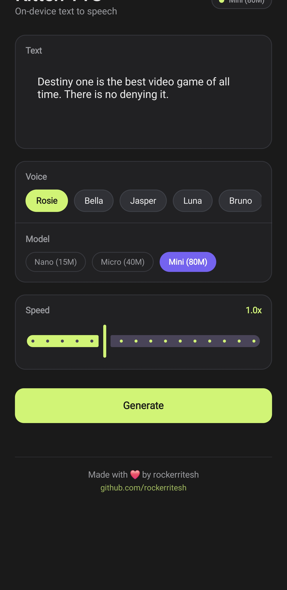
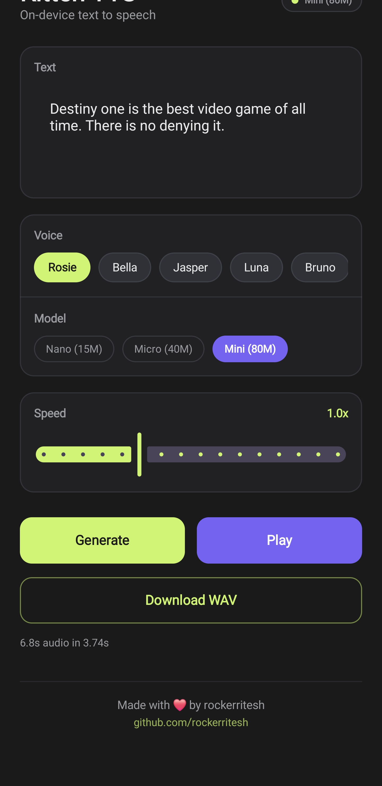

# KittenTTS Android

On-device text-to-speech Android app powered by [KittenML](https://github.com/KittenML) neural TTS models. Runs entirely offline — no internet required after install.

Ported from the [iOS version](https://github.com/user/kitten-tts-ios) (Swift/SwiftUI) to Kotlin/Jetpack Compose.

## Screenshots

<p align="center">
  
  &nbsp;&nbsp;&nbsp;
  
</p>

## Features

- 3 model sizes: **Nano** (15M), **Micro** (40M), **Mini** (80M)
- 8 voices: Rosie, Bella, Jasper, Luna, Bruno, Hugo, Kiki, Leo
- Adjustable speed (0.5x – 2.0x)
- Download generated audio as WAV
- Long text support (auto-chunking and concatenation)
- 100% on-device inference via ONNX Runtime
- Dark theme UI matching the iOS version

## Architecture

```
Text Input
  → Chunking (max 400 chars at sentence boundaries)
  → Punctuation normalization
  → espeak-ng phonemization (JNI/NDK)
  → IPA tokenization (178-token vocabulary)
  → ONNX Runtime inference (24kHz Float32 PCM)
  → AudioTrack playback
```

### Tech Stack

| Component | Technology |
|-----------|-----------|
| UI | Kotlin + Jetpack Compose |
| ML Inference | ONNX Runtime Android |
| Phonemization | espeak-ng (C via JNI/NDK) |
| Audio | AudioTrack (24kHz Float32 PCM) |
| Build | Gradle KTS, Android NDK, CMake |

## Download

Get the latest APK from [Releases](https://github.com/rockerritesh/kitten-tts-android/releases).

## Building from Source

### Prerequisites

- Android Studio (latest)
- Android SDK 34
- Android NDK 27+
- JDK 17

### Steps

1. Clone the repo:
   ```bash
   git clone https://github.com/rockerritesh/kitten-tts-android.git
   cd kitten-tts-android
   git lfs pull
   ```

2. Build espeak-ng native library:
   ```bash
   ./build-espeak-ng.sh
   ```

3. Open in Android Studio and build, or:
   ```bash
   ./gradlew assembleDebug
   ```

## Project Structure

```
app/src/main/
├── java/com/kittenml/tts/
│   ├── MainActivity.kt           # Entry point
│   ├── engine/
│   │   ├── KittenTTSEngine.kt    # Core TTS pipeline
│   │   ├── EspeakBridge.kt       # JNI wrapper
│   │   └── AudioPlayer.kt        # AudioTrack playback
│   ├── ui/
│   │   ├── theme/                 # Dark theme (Color, Theme, Type)
│   │   └── screen/
│   │       ├── TTSScreen.kt      # Main UI
│   │       └── TTSViewModel.kt   # State management
│   └── model/
│       ├── TTSModel.kt           # Model enum
│       └── EngineState.kt        # Engine state
├── cpp/
│   ├── espeak-bridge.c           # C phonemization bridge
│   ├── espeak-jni.c              # JNI glue layer
│   └── CMakeLists.txt            # NDK build config
└── assets/
    ├── models/                    # ONNX model files (~168 MB)
    ├── voices/                    # Voice embedding JSONs (~51 MB)
    └── espeak-ng-data/            # Phoneme data files (~1 MB)
```

## License

Apache 2.0
